# Kế hoạch Triển khai: MySQL/MariaDB Performance Audit & Diagnostic Engine
*(Trạng thái: ĐÃ HOÀN THÀNH 100%)*

## 1. Mục tiêu & Định vị Dự án
Xây dựng **Bộ công cụ Kiểm định & Chẩn đoán Hiệu năng Cơ sở Dữ liệu Cấp Doanh nghiệp (Enterprise-grade DB Health Check)**:
- Tương thích đa nền tảng: **MySQL 5.7, 8.0, 8.4+ LTS** và **MariaDB 10.x/11.x**.
- An toàn tuyệt đối trên Production (**100% Read-Only**, Dual-layer Timeout, Session Guardrails).
- Phân tầng linh hoạt (3-Tier Fallback): Hoạt động tối ưu khi có `performance_schema`/`sys`, và tự động fallback về `information_schema` + `SHOW GLOBAL STATUS` khi bị hạn chế quyền.
- Chấm điểm **Health Score (0-100)** theo mô hình **Trọng số 5 Trụ cột (Weighted Pillar Scoring)** có trần khấu trừ (Cap limit).
- Xuất 4 định dạng báo cáo (HTML Interactive Dashboard, Executive Markdown cho Sếp, `recommendations.sql` an toàn Online DDL, JSON thô).

---

## 2. Sơ đồ Kiến trúc 5 Trụ cột Chẩn đoán (5 Diagnostic Pillars)

```mermaid
graph TD
    A[DB Audit Engine Core] --> B[1. Schema & Index Pillar - 25%]
    A --> C[2. Lock & Concurrency Pillar - 20%]
    A --> D[3. Query & Workload Digest - 25%]
    A --> E[4. Memory & I/O Engine - 15%]
    A --> F[5. Config & my.cnf Tuner - 15%]

    B --> B1[Index trùng lặp & không dùng]
    B --> B2[Foreign Key thiếu Index & Bảng thiếu PK]
    B --> B3[Phân mảnh bảng data_free & Table Bloat]
    B --> B4[Bảng phi-InnoDB MyISAM/Memory]
    B --> B5[Bảng lớn cần Partitioning & Cột Auto-Inc]

    C --> C1[InnoDB Row Lock Waits & Contention]
    C --> C2[Giao dịch active kéo dài >30s]
    C --> C3[Bóc tách Deadlock từ INNODB STATUS]
    C --> C4[Global Wait Events theo độ trễ]

    D --> D1[Top Slow Queries theo Sum/Avg Latency]
    D --> D2[Scan Efficiency ROWS_EXAMINED / ROWS_SENT]
    D --> D3[Bão truy vấn không Index NO_INDEX_USED]
    D --> D4[Temp Disk Tables & Filesort on Disk]

    E --> E1[Buffer Pool Hit Ratio < 99%]
    E --> E2[Dirty Page Ratio & Checkpoint Lag]
    E --> E3[Redo Log Capacity & Flush Method O_DIRECT]
    E --> E4[ACID Durability vs I/O Trade-off]

    F --> F1[OOM Killer Risk Calculator Max RAM]
    F --> F2[Tính toán innodb_buffer_pool_size theo RAM]
    F --> F3[open_files_limit vs max_connections]
    F --> F4[Binlog Retention Expiration Check]
```

---

## 3. Chi tiết 6 Giai đoạn Triển khai (Implementation Phases)

### Giai đoạn 1: Làm sạch Repository & Tái cấu trúc Thư mục
- [x] Dọn dẹp conflict markers trong README.md.
- [x] Viết lại README.md hoàn chỉnh với đầy đủ sơ đồ Mermaid & ASCII, hướng dẫn CLI.
- [x] Cấu hình `package.json` với script CLI `bin/db-audit.js`, `npm run audit`, `npm test`.

### Giai đoạn 2: Xây dựng Core Connection, Version Adapters & Safety Guardrails
- [x] **`src/core/database.js`**: Kết nối bằng `mysql2/promise` với cấu hình an toàn, giải phóng pool hoàn chỉnh.
- [x] **`src/core/capability-probe.js`**:
  - Xác định chính xác Database Flavor (MySQL vs MariaDB) và Version (5.7, 8.0, 8.4+, 10.x).
  - Kiểm tra tính năng: `has_performance_schema`, `has_sys_schema`, quyền SELECT metadata.
- [x] **`src/core/version-adapter.js`**: Đóng gói các câu SQL tương thích phiên bản (ví dụ: `innodb_locks` vs `data_locks`, `innodb_redo_log_capacity` vs `innodb_log_file_size`).
- [x] **`src/core/query-runner.js`**:
  - Bảo vệ Dual-layer Timeout: Socket timeout 5000ms + Optimizer Hint `/*+ MAX_EXECUTION_TIME(5000) */`.
  - Khóa session an toàn: `SET SESSION TRANSACTION READ ONLY` & `SET SESSION innodb_stats_on_metadata = 0`.
- [x] **`src/core/scorer.js`**: Thuật toán tính **Health Score 0-100** theo trọng số 5 trụ cột (25-20-25-15-15) có trần khấu trừ (Cap limits) cho từng nhóm lỗi.

### Giai đoạn 3: Xây dựng 5 Bộ Phân tích Chuyên sâu (Analyzers)
- [x] **`src/analyzers/schema-index.js` (Trụ cột 1 - 25đ)**:
  - Quét index trùng lặp/dư thừa & index không sử dụng.
  - Quét FK thiếu index & bảng không có Primary Key.
  - Phân tích phân mảnh bảng (Table Fragmentation & Data Free > 1GB).
  - Kiểm tra Storage Engine (phát hiện MyISAM/Memory).
  - Kiểm tra bão hòa cột Auto-Increment (>75%) & đề xuất Partitioning bảng >20M rows.
- [x] **`src/analyzers/lock-wait.js` (Trụ cột 2 - 20đ)**:
  - Quét giao dịch treo >30s (`information_schema.innodb_trx`).
  - Quét lock wait contention (`data_locks` / `data_lock_waits` hoặc `innodb_lock_waits`).
  - Bóc tách block `LATEST DETECTED DEADLOCK` và đo lường tần suất Deadlock.
  - Phân tích Top Wait Events theo tổng thời gian chờ.
- [x] **`src/analyzers/query-digest.js` (Trụ cột 3 - 25đ)**:
  - Top 10 truy vấn tốn thời gian nhất (Sum Latency & Avg Latency).
  - Tỷ lệ hiệu quả quét: `ROWS_EXAMINED / ROWS_SENT` (phát hiện query quét triệu dòng trả về vài dòng).
  - Phát hiện bão truy vấn không dùng index (`SUM_NO_INDEX_USED`).
  - Phân tích Full Table Scans, Created Tmp Disk Tables, Filesort on Disk.
- [x] **`src/analyzers/memory-io.js` (Trụ cột 4 - 15đ)**:
  - Buffer Pool Hit Ratio (< 99%), Dirty Page Ratio & Checkpoint Lag.
  - Redo Log Capacity (tương thích 8.4+ `innodb_redo_log_capacity`) & Wait Ratio.
  - Kiểm tra `innodb_flush_log_at_trx_commit`, `sync_binlog` & `innodb_flush_method` (O_DIRECT).
  - Đánh giá Thread Cache Miss Ratio & Table Open Cache.
- [x] **`src/analyzers/config-tuner.js` (Trụ cột 5 - 15đ)**:
  - **OOM Killer Risk Calculator**: Tính toán Max RAM Usage lý thuyết so với RAM vật lý.
  - Tính toán kích thước tối ưu cho `innodb_buffer_pool_size`, `innodb_log_file_size`/`redo_capacity`.
  - Đối soát `open_files_limit` với `max_connections` và `table_open_cache`.
  - Kiểm tra cấu hình hạn lưu Binary Log (`binlog_expire_logs_seconds`).
- [x] **`src/analyzers/index.js`**: Điều phối 5 Analyzers và bọc cách ly lỗi (fault isolation).

### Giai đoạn 4: Xây dựng Bộ Báo cáo Đa định dạng (Reporters)
- [x] **`src/reporters/html-reporter.js`**: Sinh file HTML Dashboard độc lập (standalone, responsive, dark/light theme, Health Score ring gauge, filterable tables, copy-ready SQL).
- [x] **`src/reporters/markdown-reporter.js`**: Báo cáo tổng hợp Executive Summary chuyên nghiệp cho cấp quản lý.
- [x] **`src/reporters/sql-fix-reporter.js`**: Sinh `recommendations.sql` chuẩn **Zero-Downtime Migration**:
  - Sử dụng Online DDL (`ALGORITHM=INPLACE, LOCK=NONE`).
  - Cảnh báo bảng lớn (>10M rows) kèm gợi ý `pt-online-schema-change` / `gh-ost`.
  - Phân chia 4 Phase thực thi và script Rollback tương ứng.
- [x] **`src/reporters/json-reporter.js`**: Xuất `audit-report.json` cho CI/CD.
- [x] **`src/reporters/index.js`**: Điều phối xuất đồng thời 4 định dạng.

### Giai đoạn 5: Giao diện CLI & Viết lại README.md Toàn diện
- [x] Xây dựng CLI `src/cli.js` & `bin/db-audit.js` hỗ trợ đầy đủ flags (`--host`, `--port`, `--user`, `--password`, `--database`, `--out-dir`, `--format`, `--quick`, `--help`).
- [x] Xây dựng API programmatic `src/index.js`.

### Giai đoạn 6: Kiểm thử Tự động (Automated Testing với Jest) & Xác thực
- [x] Viết bộ Unit Test Jest cho Scorer, Version Adapter, Analyzers và Reporters (16/16 test passed 100%).
- [x] Kiểm tra độ dài dòng code (<120 ký tự) trên toàn bộ dự án (0 dòng vi phạm).
- [x] Rà soát an toàn mã nguồn với Subagent Code Reviewer & Risk Analyst.
- [x] Tạo tài liệu `walkthrough.md` ghi nhận bằng chứng kiểm thử.
