# MySQL & MariaDB Performance Audit & Diagnostics Engine

> **Enterprise-grade Database Health Check, Performance Bottleneck Audit & Optimization Engine**  
> Tương thích toàn diện với MySQL 5.7, MySQL 8.0, MySQL 8.4+ LTS và MariaDB 10.x / 11.x.

---

## 🌟 Tổng quan Dự án (Project Overview)

**DB Performance Audit Engine** là bộ công cụ chuyên sâu dành cho Database Administrators (DBA), Tech Leads, 
và Backend Engineers nhằm quét, chẩn đoán, phát hiện toàn bộ các điểm nghẽn hiệu năng trên cơ sở dữ liệu MySQL/MariaDB.

Công cụ tự động phân tích cơ sở dữ liệu trên **5 Trụ cột Hiệu năng Cốt lõi**, tính toán **Điểm Sức Khỏe (Health Score 0-100)** 
và xuất báo cáo đa định dạng chuyên nghiệp phục vụ **báo cáo trực tiếp với Ban Quản lý/Sếp** cùng bộ mã lệnh khắc phục an toàn.

---

## 🏛️ Sơ đồ 5 Trụ cột Chẩn đoán (5 Diagnostic Pillars)

### 1. Sơ đồ Mermaid (Mermaid Architecture Diagram)

```mermaid
graph TD
    A[DB Performance Audit Engine] --> B[1. Schema & Index Pillar - 25%]
    A --> C[2. Lock & Concurrency Pillar - 20%]
    A --> D[3. Query & Workload Digest - 25%]
    A --> E[4. Memory & I/O Engine - 15%]
    A --> F[5. Configuration & my.cnf Tuner - 15%]

    B --> B1[Index trùng lặp & dư thừa]
    B --> B2[Index không sử dụng - Unused Indexes]
    B --> B3[Foreign Key thiếu Index]
    B --> B4[Bảng không có Primary Key]
    B --> B5[Phân mảnh bảng data_free & Table Bloat]
    B --> B6[Bảng phi-InnoDB MyISAM & Bão hòa Auto-Inc]

    C --> C1[InnoDB Row Lock Waits & Contention]
    C --> C2[Giao dịch active kéo dài >30s]
    C --> C3[Bóc tách Deadlock từ INNODB STATUS]
    C --> C4[Phân tầng Global Wait Events theo độ trễ]

    D --> D1[Top Slow Queries theo Sum & Avg Latency]
    D --> D2[Scan Efficiency ROWS_EXAMINED / ROWS_SENT]
    D --> D3[Bão truy vấn không Index NO_INDEX_USED]
    D --> D4[Temp Disk Tables & Filesort on Disk]

    E --> E1[Buffer Pool Hit Ratio < 99%]
    E --> E2[Dirty Page Ratio & Checkpoint Lag]
    E --> E3[Redo Log Capacity & Flush Method O_DIRECT]
    E --> E4[ACID Durability vs I/O Trade-off]

    F --> F1[OOM Killer Risk Calculator Max RAM]
    F --> F2[Tính toán innodb_buffer_pool_size theo RAM]
    F --> F3[open_files_limit vs max_connections]
    F --> F4[Binlog Retention Expiration Check]
```



### 2. Sơ đồ Khối ASCII (ASCII Architecture Blueprint)

```
┌──────────────────────────────────────────────────────────────────────────────────────────────────┐
│                    MySQL / MariaDB Performance Audit & Diagnostics Engine                        │
└────────────────────────────────────────────────┬─────────────────────────────────────────────────┘
                                                 │
 ┌──────────────────────┬────────────────────────┼────────────────────────┬──────────────────────┐
 │                      │                        │                        │                      │
 ▼                      ▼                        ▼                        ▼                      ▼
┌──────────────────┐   ┌──────────────────┐   ┌──────────────────┐   ┌──────────────────┐   ┌──────────────────┐
│ 1. SCHEMA & INDEX│   │ 2. LOCK & CONCUR │   │ 3. QUERY DIGEST  │   │ 4. MEMORY & I/O  │   │ 5. CONFIG TUNING │
│   (Trọng số 25%) │   │   (Trọng số 20%) │   │   (Trọng số 25%) │   │   (Trọng số 15%) │   │   (Trọng số 15%) │
├──────────────────┤   ├──────────────────┤   ├──────────────────┤   ├──────────────────┤   ├──────────────────┤
│• Redundant Idx   │   │• Row Lock Waits  │   │• Top Slow Digest │   │• Buffer Pool Hit │   │• OOM Killer Risk │
│• Unused Indexes  │   │• Long Trx (>30s) │   │• Scan Efficiency │   │• Dirty Page Rate │   │• RAM Sizing Recs │
│• Missing FK Idx  │   │• Deadlock History│   │• No-Index Storms │   │• Redo Log Sizing │   │• Max Connections │
│• Tables No PK    │   │• Wait Event Sums │   │• Full Table Scans│   │• O_DIRECT Flush  │   │• Open Files Limit│
│• Table Bloat/Free│   │• Metadata Locks  │   │• Temp Disk Tables│   │• ACID vs IO Trade│   │• Binlog Retention│
│• Auto-Inc Limit  │   │• Thread Saturation│  │• Filesort on Disk│   │• Cache Miss Rate │   │• Anti-patterns   │
└──────────────────┘   └──────────────────┘   └──────────────────┘   └──────────────────┘   └──────────────────┘
                                                 │
                                                 ▼
┌──────────────────────────────────────────────────────────────────────────────────────────────────┐
│                               MULTI-FORMAT DELIVERABLES PIPELINE                                 │
│  1. Standalone HTML Dashboard (Offline, interactive, Health Score gauge, visual evidence)        │
│  2. Executive Summary Markdown (Tóm tắt hiện trạng, rủi ro và chiến lược tối ưu cho Sếp)       │
│  3. fix-recommendations.sql (Mã lệnh Online DDL ALGORITHM=INPLACE, 4 Phase thực thi & Rollback)  │
│  4. Structured JSON Report (Dữ liệu thô phục vụ tích hợp CI/CD Pipeline)                        │
└──────────────────────────────────────────────────────────────────────────────────────────────────┘
```

---

## 🛡️ Nguyên tắc An toàn Tuyệt đối trên Production (Safety Guardrails)

- **100% Read-Only Session:** Ngay khi kết nối, session được khóa bằng `SET SESSION TRANSACTION READ ONLY`.
- **Dual-Layer Timeout Protection:** Bọc tất cả câu lệnh SELECT bằng Optimizer Hint `/*+ MAX_EXECUTION_TIME(5000) */` 
  và thiết lập Node.js Socket Timeout 5000ms để triệt tiêu nguy cơ treo database khi đang chịu tải.
- **Tắt Auto Stats Update trên MySQL 5.7:** Tự động gán `innodb_stats_on_metadata = 0` tránh gây I/O disk đột ngột khi đọc `information_schema`.
- **Cơ chế Phân tầng Linh hoạt (3-Tier Fallback):** Tự động chuyển đổi giữa `sys schema` -> `performance_schema` -> `information_schema` + `SHOW GLOBAL STATUS` nếu database bị hạn chế quyền.
- **Cách ly Lỗi Từng phần (Fault Isolation):** Mỗi Analyzer độc lập trong `try-catch`, đảm bảo khi 1 bảng bị lỗi thì các module còn lại vẫn hoàn thành.

---

## 🚀 Cài đặt & Hướng dẫn Sử dụng (Quick Start)

### 1. Yêu cầu Môi trường
- Node.js >= 16.0.0 (Khuyên dùng v18 hoặc v20 LTS)
- Quyền truy cập MySQL 5.7, 8.0, 8.4+ hoặc MariaDB 10.x/11.x (User chỉ cần quyền `SELECT` và `PROCESS`).

### 2. Cài đặt Dependencies
```bash
git clone https://github.com/adamphh/agentai-mysql-checking.git
cd agentai-mysql-checking
npm install
```

### 3. Cấu hình Môi trường (.env)
```bash
cp .env.example .env
# Chỉnh sửa thông tin kết nối DB trong .env
```

### 4. Chạy Kiểm định & Xuất Báo cáo (Run Audit)

#### Chạy qua npm script (sử dụng cấu hình từ `.env`):
```bash
npm run audit
```

#### Chạy trực tiếp qua CLI với tham số tùy chọn:
```bash
node bin/db-audit.js --host=127.0.0.1 --port=3306 --user=root --password=secret --database=shop_db --output-dir=./reports
```

#### Các tùy chọn dòng lệnh (CLI Options):
```
Options:
  -h, --host <host>          Địa chỉ máy chủ MySQL/MariaDB (Mặc định: 127.0.0.1)
  -P, --port <port>          Cổng kết nối (Mặc định: 3306)
  -u, --user <user>          Tên tài khoản cơ sở dữ liệu (Mặc định: root)
  -p, --password <password>  Mật khẩu truy cập
  -d, --database <database>  Tên cơ sở dữ liệu cần kiểm tra chi tiết
  -o, --output-dir <dir>     Thư mục xuất báo cáo (Mặc định: ./reports)
  -f, --format <formats>     Định dạng xuất: all, html, md, sql, json (Mặc định: all)
  -q, --quick                Chế độ quét nhanh (bỏ qua deep table fragmentation)
  --help                     Hiển thị hướng dẫn
```

---

## 📊 Cấu trúc Báo cáo Đầu ra (Output Deliverables)

Sau khi hoàn tất quá trình quét, thư mục `./reports` sẽ tự động sinh 4 tệp:

1. **`audit-report.html` (Interactive Dashboard):**
   - Vòng tròn hiển thị **Health Score (0-100)** trực quan.
   - Thống kê thẻ số lượng lỗi: Critical, Warning, Info.
   - Bộ lọc tìm kiếm nhanh các vấn đề theo Trụ cột hoặc Mức độ nghiêm trọng.
   - Chi tiết bằng chứng kỹ thuật (SQL query, bảng liên quan, thời gian trễ).
   - Nút Copy mã lệnh khắc phục nhanh một chạm.
2. **`EXECUTIVE_SUMMARY.md` (Báo cáo dành cho Ban Quản lý/Sếp):**
   - Đánh giá tổng quan hiện trạng và rủi ro vận hành.
   - Bảng phân tích 5 trụ cột và mức độ ảnh hưởng kinh doanh.
   - Lộ trình tối ưu hóa và dự báo ROI (tiết kiệm bao nhiêu % CPU, RAM, thời gian phản hồi).
3. **`recommendations.sql` (Mã lệnh khắc phục an toàn):**
   - Phân chia 4 Phase rõ ràng:
     - `Phase 1: Online DDL` (Tạo Index với `ALGORITHM=INPLACE, LOCK=NONE`).
     - `Phase 2: Maintenance Window` (Xóa Index thừa, gộp phân mảnh, Partition).
     - `Phase 3: Dynamic Parameter Tuning` (`SET GLOBAL...`).
     - `Phase 4: Persistent Config` (Cập nhật file cấu hình `my.cnf`).
   - Cảnh báo bảng lớn (>10M dòng) kèm gợi ý chạy qua `pt-online-schema-change` / `gh-ost`.
   - Kèm script Rollback cho từng lệnh.
4. **`audit-report.json` (Structured Raw Data):**
   - Chứa toàn bộ số liệu đo lường thô, phù hợp tích hợp vào CI/CD pipeline hoặc hệ thống giám sát nội bộ.

---

## 🧪 Chạy Kiểm thử Tự động (Automated Testing)

```bash
# Chạy toàn bộ Unit Test suite
npm test

# Chạy test và xuất báo cáo độ bao phủ mã nguồn
npm run test:coverage
```

---

## 📂 Cấu trúc Mã nguồn (Project Directory Layout)

```
agentai-mysql-checking/
├── bin/
│   └── db-audit.js              # CLI executable wrapper
├── src/
│   ├── core/
│   │   ├── database.js          # Connection manager & safety pool
│   │   ├── capability-probe.js  # Version & engine capability detector
│   │   ├── version-adapter.js   # Cross-version SQL compatibility layer
│   │   ├── query-runner.js      # Dual-timeout & read-only executor
│   │   └── scorer.js            # Weighted 5-Pillar Health Scorer
│   ├── analyzers/
│   │   ├── schema-index.js      # Pillar 1: Schema, indexes, bloat, PK/FK
│   │   ├── lock-wait.js         # Pillar 2: Locks, deadlocks, long trx, waits
│   │   ├── query-digest.js      # Pillar 3: Slow queries, scans, efficiency
│   │   ├── memory-io.js         # Pillar 4: Buffer pool, redo, cache, I/O
│   │   ├── config-tuner.js      # Pillar 5: OOM calculator, my.cnf tuning
│   │   └── index.js             # Master analyzer runner
│   ├── reporters/
│   │   ├── html-reporter.js     # Standalone HTML dashboard generator
│   │   ├── markdown-reporter.js # Executive summary markdown generator
│   │   ├── sql-fix-reporter.js  # Online DDL & phased SQL fix generator
│   │   └── json-reporter.js     # Machine-readable JSON exporter
│   ├── cli.js                   # CLI argument parser & orchestration
│   └── index.js                 # Programmatic Node.js API entry point
├── tests/
│   ├── unit/                    # Unit tests for core, analyzers, reporters
│   └── mocks/                   # Mock database fixtures & state
├── Plans/                       # Implementation plans & architectural blueprints
├── package.json
└── README.md
```

---

## 📜 Giấy phép (License)

Phát hành dưới giấy phép [MIT License](LICENSE).
